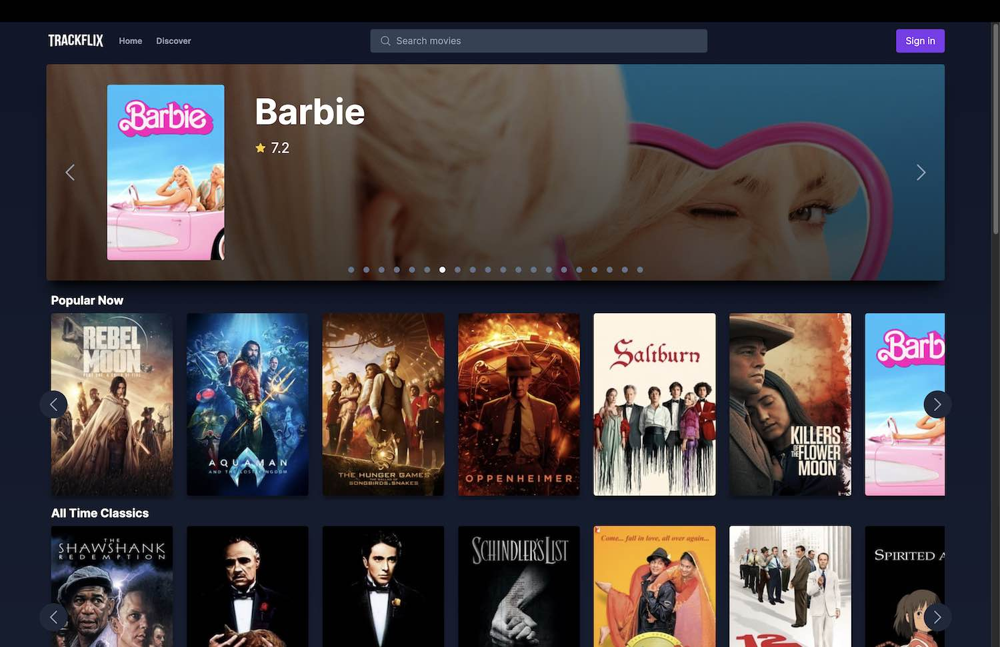

# Nextflik

## React Movie App

### Description

Nextflik is a simple movie app built with react to search movies and add them to a watchlist.

### Features:

- Browse, filter, search and sort movies, using the TMDB API
- Save movies to a watchlist, using browser local storage

### Key Technologies:

- React (vite)
- Tailwind CSS
- TypeScript
- TMDB API

## Screenshots

### Home Page

